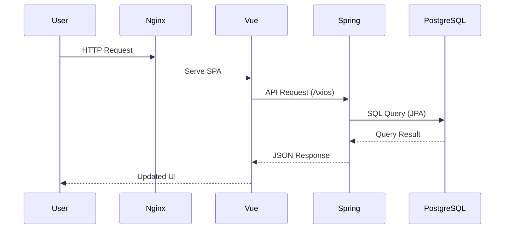

## Overview

EasyACT is a personal finance tracking web application built on a modern **3-tier architecture** that separates concerns between presentation, business logic, and data persistence layers.

<Note>
  The application uses a **frontend-backend separation** architecture, with all services containerized using Docker Compose for streamlined deployment.
</Note>

## Architecture Diagram

The system follows a classic client-server architecture with three distinct layers:

```
┌─────────────┐      ┌─────────────┐      ┌─────────────┐
│             │      │             │      │             │
│   Web UI    │─────▶│   API       │─────▶│  Database   │
│  (Vue.js)   │      │ (Spring     │      │ (PostgreSQL)│
│   Nginx     │      │  Boot)      │      │             │
│             │      │             │      │             │
└─────────────┘      └─────────────┘      └─────────────┘
   Port: 8000           Port: 8080          Port: 5432
```

## Three-Tier Architecture

<CardGroup cols={3}>
  <Card title="Presentation Layer" icon="desktop">
    **Frontend (Vue.js)**
    
    - Vue 3 SPA with Vue Router
    - PrimeVue UI components
    - Pinia state management
    - Chart.js data visualization
    - Served via Nginx
  </Card>
  
  <Card title="Application Layer" icon="server">
    **Backend (Spring Boot)**
    
    - RESTful API endpoints
    - Business logic processing
    - JPA entity management
    - OpenAPI documentation
    - Maven-based build
  </Card>
  
  <Card title="Data Layer" icon="database">
    **Database (PostgreSQL)**
    
    - Relational data storage
    - ACID compliance
    - Data persistence
    - PostgreSQL 15
    - Docker volume storage
  </Card>
</CardGroup>

## Component Details

### Frontend (Presentation Layer)

The frontend is a **Single Page Application (SPA)** built with Vue.js 3:

<Accordion title="Key Responsibilities">
  - **User Interface**: Renders interactive UI using PrimeVue components
  - **Routing**: Manages navigation with Vue Router
  - **State Management**: Handles application state with Pinia stores
  - **Data Visualization**: Displays financial charts using Chart.js
  - **HTTP Communication**: Makes API requests via Axios
  - **Static Serving**: Nginx serves production build on port 8000
</Accordion>

**Project Structure**:
```
web/
├── src/
│   ├── components/          # Reusable Vue components
│   │   ├── ChartView/       # Chart visualization components
│   │   └── ListView/        # List and table components
│   ├── layout/              # Layout components
│   ├── router/              # Vue Router configuration
│   ├── stores/              # Pinia state stores
│   ├── views/               # Page view components
│   ├── App.vue              # Root component
│   └── main.js              # Application entry point
├── nginx.conf               # Nginx web server config
└── package.json             # NPM dependencies
```

### Backend (Application Layer)

The backend is a **Spring Boot 4.0.1** application using Java 25:

<Accordion title="Key Responsibilities">
  - **RESTful API**: Exposes HTTP endpoints for CRUD operations
  - **Business Logic**: Processes account book transactions, category management
  - **Data Validation**: Validates incoming requests via DTOs
  - **ORM Mapping**: Maps Java entities to database tables with JPA
  - **API Documentation**: Auto-generates OpenAPI docs with SpringDoc
  - **Database Access**: Interacts with PostgreSQL via Spring Data JPA
</Accordion>

**Project Structure**:
```java
api/src/main/java/com/raylon/api/
├── config/                  # Configuration classes
│   └── OpenApiConfig.java   # OpenAPI/Swagger configuration
├── controller/              # REST API controllers
├── dto/                     # Data Transfer Objects
├── model/                   # JPA entity models
│   ├── AccountBook.java     # Main transaction entity
│   ├── Action.java          # Income/Expense type
│   └── Category.java        # Transaction category
├── repository/              # Spring Data JPA repositories
└── service/                 # Business logic services
```

<Tip>
  Access the interactive API documentation at `http://localhost:8080/swagger-ui.html` after starting the services.
</Tip>

### Database (Data Layer)

The database layer uses **PostgreSQL 15** for persistent data storage:

<Accordion title="Key Responsibilities">
  - **Data Persistence**: Stores account books, categories, and actions
  - **Relational Integrity**: Maintains foreign key relationships
  - **Query Optimization**: Indexes on frequently queried columns
  - **Transaction Support**: ACID-compliant transaction processing
  - **Data Volume**: Persisted via Docker volume for data durability
</Accordion>

**Core Tables**:
- `account_books` - Transaction records (main entity)
- `categories` - Transaction categories (e.g., Food, Transport)
- `actions` - Transaction types (Income/Expense)

See [Database Schema](/development/database-schema) for detailed entity relationships.

## Communication Flow

### Request Flow (User → Database)



<Steps>
  <Step title="User Interaction">
    User interacts with the Vue.js frontend via browser
  </Step>
  
  <Step title="API Request">
    Frontend sends HTTP request to Spring Boot API (port 8080)
  </Step>
  
  <Step title="Business Logic">
    Spring Boot controller processes request, delegates to service layer
  </Step>
  
  <Step title="Data Access">
    Service layer uses JPA repository to query PostgreSQL database
  </Step>
  
  <Step title="Response">
    Data flows back through layers: DB → JPA → Service → Controller → JSON response
  </Step>
  
  <Step title="UI Update">
    Vue.js receives JSON, updates Pinia store, and re-renders components
  </Step>
</Steps>

## Deployment Architecture

<Warning>
  All services are containerized and orchestrated using **Docker Compose** for consistent deployment.
</Warning>

### Container Setup

<CardGroup cols={3}>
  <Card title="Web Container" icon="globe">
    **nginx:stable-alpine**
    
    - Serves static Vue.js build
    - Port mapping: 8000:80
    - Reverse proxy configuration
  </Card>
  
  <Card title="API Container" icon="java">
    **Custom Java 25 Image**
    
    - Spring Boot application
    - Port mapping: 8080:8080
    - Connects to DB via bridge network
  </Card>
  
  <Card title="DB Container" icon="database">
    **postgres:15**
    
    - PostgreSQL database
    - Port mapping: 5432:5432
    - Data persisted in volume
  </Card>
</CardGroup>

### Network Configuration

- **Network Mode**: Bridge network connecting all containers
- **Service Discovery**: Containers communicate via service names
- **External Access**: Only web (8000) and API (8080) ports exposed to host

```yaml
# docker-compose.yml structure
services:
  web:      # Nginx + Vue.js (port 8000)
  api:      # Spring Boot (port 8080)
  db:       # PostgreSQL (port 5432)
  
networks:
  default:
    driver: bridge
    
volumes:
  postgres-data:  # Persistent database storage
```

## Design Principles

<AccordionGroup>
  <Accordion title="Separation of Concerns">
    Each layer has distinct responsibilities with minimal coupling between them
  </Accordion>
  
  <Accordion title="Stateless Backend">
    Spring Boot API is stateless, allowing horizontal scaling
  </Accordion>
  
  <Accordion title="RESTful Design">
    API follows REST principles with standard HTTP methods and status codes
  </Accordion>
  
  <Accordion title="Containerization">
    All components dockerized for consistent deployment across environments
  </Accordion>
  
  <Accordion title="Single Responsibility">
    Each module handles one aspect: UI, business logic, or data persistence
  </Accordion>
</AccordionGroup>

## Technology Decisions

| Decision | Rationale |
|----------|----------|
| **Vue.js 3** | Modern reactive framework with excellent performance and developer experience |
| **Spring Boot 4** | Mature Java framework with robust ecosystem and enterprise-grade features |
| **PostgreSQL 15** | Reliable ACID-compliant RDBMS with excellent JSON support and performance |
| **Docker Compose** | Simplified multi-container orchestration for development and deployment |
| **Nginx** | High-performance web server for serving static assets |
| **JPA/Hibernate** | Standard ORM abstraction reducing boilerplate database code |

## Next Steps

<CardGroup cols={2}>
  <Card title="Technology Stack" icon="layer-group" href="/development/tech-stack">
    View detailed version information for all dependencies
  </Card>
  
  <Card title="Database Schema" icon="table" href="/development/database-schema">
    Explore entity models and table relationships
  </Card>
</CardGroup>