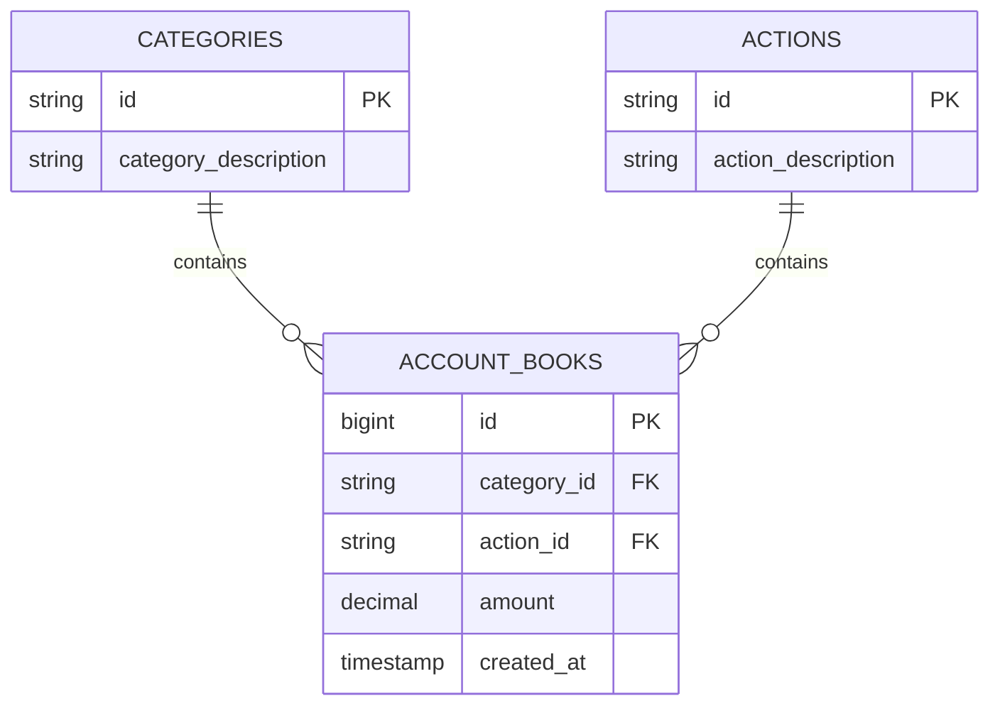

## Overview

EasyACT uses PostgreSQL as the primary database with Spring Data JPA for object-relational mapping. This guide covers database configuration, entity relationships, and JPA best practices.

## Database Configuration

### PostgreSQL Setup

The application is configured to connect to PostgreSQL using the following settings:

```properties application.properties
# PostgreSQL DataSource Configuration
spring.datasource.url=jdbc:postgresql://db:5432/easy_act
spring.datasource.username=postgres
spring.datasource.password=postgres_password
spring.datasource.driver-class-name=org.postgresql.Driver

# JPA Configuration
spring.jpa.hibernate.ddl-auto=none
spring.jpa.show-sql=true
spring.jpa.properties.hibernate.dialect=org.hibernate.dialect.PostgreSQLDialect

# Server Configuration
server.port=8080
```

<Info>
  **DDL Auto Mode**: The setting `spring.jpa.hibernate.ddl-auto=none` means Hibernate will NOT automatically create or update database tables. You must manage schema changes manually or with migration tools.
</Info>

### Configuration Properties Explained

<AccordionGroup>
  <Accordion title="DataSource Properties">
    - **url**: JDBC connection string pointing to PostgreSQL
      - `db` is the hostname (typically `localhost` for local dev)
      - `5432` is the default PostgreSQL port
      - `easy_act` is the database name
    - **username/password**: Database credentials
    - **driver-class-name**: PostgreSQL JDBC driver
  </Accordion>
  
  <Accordion title="JPA Properties">
    - **hibernate.ddl-auto**: Controls automatic schema generation
      - `none` - No automatic schema management (production)
      - `validate` - Validate schema matches entities
      - `update` - Update schema (dev only, not recommended)
      - `create` - Drop and recreate schema (testing only)
      - `create-drop` - Drop schema on shutdown (testing only)
    - **show-sql**: Log SQL statements to console (useful for debugging)
    - **hibernate.dialect**: Database-specific SQL dialect
  </Accordion>
</AccordionGroup>

## Database Schema

The EasyACT database consists of three main tables with relationships:



## JPA Entity Mapping

### Entity Annotations Overview

<CodeGroup>
```java Core JPA Annotations
@Entity                          // Marks class as JPA entity
@Table(name = "table_name")      // Maps to database table
@Id                              // Marks primary key field
@Column(name = "column_name")    // Maps to database column
@GeneratedValue                  // Auto-generate ID values
```

```java Relationship Annotations
@OneToMany                       // One-to-many relationship
@ManyToOne                       // Many-to-one relationship
@JoinColumn                      // Specifies foreign key column
@FetchType.LAZY                  // Lazy load related entities
@FetchType.EAGER                 // Eagerly load related entities
```

```java Lombok Annotations
@Getter                          // Generate getter methods
@Setter                          // Generate setter methods
@NoArgsConstructor              // Generate no-args constructor
@AllArgsConstructor             // Generate all-args constructor
```
</CodeGroup>

### Category Entity

The Category entity represents expense/income categories.

```java Category.java
package com.raylon.api.model;

import java.util.List;
import jakarta.persistence.*;
import lombok.Getter;
import lombok.Setter;

@Entity
@Table(name = "categories")
@Getter
@Setter
public class Category {

    @Id
    @Column(name = "id")
    private String id;

    @Column(name = "category_description")
    private String categoryDescription;

    // Bidirectional relationship - one category has many account books
    @OneToMany(mappedBy = "category", fetch = FetchType.LAZY)
    private List<AccountBook> accountBooks;
}
```

<Steps>
  <Step title="Entity Declaration">
    `@Entity` marks this class as a JPA entity, and `@Table(name = "categories")` maps it to the `categories` table.
  </Step>
  
  <Step title="Primary Key">
    `@Id` designates `id` as the primary key. This is a String type, not auto-generated.
  </Step>
  
  <Step title="Column Mapping">
    `@Column` annotations map Java fields to database columns. The `name` attribute specifies the exact column name.
  </Step>
  
  <Step title="Relationship Mapping">
    `@OneToMany` establishes a one-to-many relationship with AccountBook. The `mappedBy` attribute indicates this is the inverse side of the relationship.
  </Step>
</Steps>

<Warning>
  **Lazy Loading**: The `FetchType.LAZY` setting means related AccountBooks are NOT loaded until explicitly accessed. This prevents performance issues but can cause `LazyInitializationException` if accessed outside a transaction.
</Warning>

### Relationship Patterns

#### One-to-Many Relationship

Categories have a one-to-many relationship with AccountBooks:

<CodeGroup>
```java Category (Owner Side)
@Entity
public class Category {
    @Id
    private String id;
    
    // One category can have many account books
    @OneToMany(mappedBy = "category", fetch = FetchType.LAZY)
    private List<AccountBook> accountBooks;
}
```

```java AccountBook (Referencing Side)
@Entity
public class AccountBook {
    @Id
    @GeneratedValue(strategy = GenerationType.IDENTITY)
    private Long id;
    
    // Many account books belong to one category
    @ManyToOne(fetch = FetchType.LAZY)
    @JoinColumn(name = "category_id")
    private Category category;
}
```
</CodeGroup>

<Note>
  **Bidirectional Relationships**: The `mappedBy` attribute in `@OneToMany` indicates that the `category` field in the `AccountBook` entity owns the relationship. The foreign key column exists in the `account_books` table.
</Note>

## Repository Layer

Spring Data JPA repositories provide database operations without boilerplate code.

### Basic Repository

```java CategoryRepository.java
package com.raylon.api.repository;

import org.springframework.data.jpa.repository.JpaRepository;
import com.raylon.api.model.Category;

public interface CategoryRepository extends JpaRepository<Category, String> {
    // Inherits all CRUD methods from JpaRepository:
    // - List<Category> findAll()
    // - Optional<Category> findById(String id)
    // - Category save(Category entity)
    // - void deleteById(String id)
    // - boolean existsById(String id)
    // - long count()
    // - void deleteAllInBatch(Iterable<Category> entities)
    // - List<Category> findAllById(Iterable<String> ids)
}
```

### Custom Query Methods

Spring Data JPA can derive queries from method names:

```java
public interface CategoryRepository extends JpaRepository<Category, String> {
    // Find by exact match
    Optional<Category> findByCategoryDescription(String description);
    
    // Find by partial match (LIKE query)
    List<Category> findByCategoryDescriptionContaining(String keyword);
    
    // Find by multiple criteria
    List<Category> findByIdAndCategoryDescription(String id, String description);
    
    // Custom queries with @Query
    @Query("SELECT c FROM Category c WHERE c.categoryDescription LIKE %:keyword%")
    List<Category> searchByKeyword(@Param("keyword") String keyword);
}
```

<Tip>
  **Query Method Naming Convention**: Spring Data JPA automatically generates SQL from method names following specific patterns:
  - `findBy` + Field Name
  - `findBy` + Field Name + `Containing` (LIKE query)
  - `findBy` + Field Name + `And` + Another Field
  - `existsBy` + Field Name
  - `countBy` + Field Name
</Tip>

## Common Database Operations

### Create Operations

```java
// Single entity
Category category = new Category();
category.setId("FOOD");
category.setCategoryDescription("Food & Dining");
categoryRepository.save(category);

// Batch insert
List<Category> categories = Arrays.asList(category1, category2, category3);
categoryRepository.saveAll(categories);
```

### Read Operations

```java
// Find all
List<Category> all = categoryRepository.findAll();

// Find by ID
Optional<Category> category = categoryRepository.findById("FOOD");

// Find multiple by IDs
List<String> ids = Arrays.asList("FOOD", "TRANSPORT", "HOUSING");
List<Category> categories = categoryRepository.findAllById(ids);

// Check existence
boolean exists = categoryRepository.existsById("FOOD");

// Count records
long count = categoryRepository.count();
```

### Update Operations

```java
// Update existing entity
Category category = categoryRepository.findById("FOOD")
    .orElseThrow(() -> new ResponseStatusException(
        HttpStatus.NOT_FOUND, "Category not found"
    ));

category.setCategoryDescription("Food & Beverages");
categoryRepository.save(category);  // save() handles both create and update
```

<Info>
  **Save Method Behavior**: The `save()` method performs an "upsert" - if the entity has an ID that exists in the database, it updates; otherwise, it inserts a new record.
</Info>

### Delete Operations

```java
// Delete by ID
categoryRepository.deleteById("FOOD");

// Delete entity
Category category = categoryRepository.findById("FOOD").orElseThrow();
categoryRepository.delete(category);

// Batch delete (more efficient)
List<Category> categories = categoryRepository.findAllById(ids);
categoryRepository.deleteAllInBatch(categories);

// Delete all
categoryRepository.deleteAll();  // Use with caution!
```

## Transaction Management

Spring automatically manages transactions for repository methods, but you can control them explicitly:

```java
@Service
public class CategoryService {
    
    @Transactional  // Method runs in a transaction
    public void updateCategory(CategoryRequest request) {
        Category category = categoryRepository.findById(request.getId())
            .orElseThrow(() -> new ResponseStatusException(
                HttpStatus.NOT_FOUND, "Category not found"
            ));
        
        category.setCategoryDescription(request.getCategoryDescription());
        categoryRepository.save(category);
        
        // If any exception occurs, all changes are rolled back
    }
    
    @Transactional(readOnly = true)  // Optimization for read-only operations
    public List<CategoryResponse> getAllCategories() {
        return categoryRepository.findAll()
            .stream()
            .map(c -> new CategoryResponse(c.getId(), c.getCategoryDescription()))
            .collect(Collectors.toList());
    }
}
```

<AccordionGroup>
  <Accordion title="@Transactional Benefits">
    - **Atomicity**: All database operations succeed or fail together
    - **Consistency**: Database remains in a valid state
    - **Isolation**: Concurrent transactions don't interfere
    - **Durability**: Committed changes are permanent
  </Accordion>
  
  <Accordion title="@Transactional(readOnly = true)">
    Optimizes read-only operations:
    - Disables dirty checking (performance boost)
    - May use read-only database replicas
    - Prevents accidental modifications
  </Accordion>
</AccordionGroup>

## Database Migration Best Practices

<Warning>
  **Schema Management**: With `ddl-auto=none`, you must manage schema changes manually. Consider using Flyway or Liquibase for versioned migrations.
</Warning>

### Flyway Example

Add Flyway dependency to `pom.xml`:

```xml
<dependency>
    <groupId>org.flywaydb</groupId>
    <artifactId>flyway-core</artifactId>
</dependency>
<dependency>
    <groupId>org.flywaydb</groupId>
    <artifactId>flyway-database-postgresql</artifactId>
</dependency>
```

Create migration files in `src/main/resources/db/migration/`:

<CodeGroup>
```sql V1__create_categories_table.sql
CREATE TABLE categories (
    id VARCHAR(50) PRIMARY KEY,
    category_description VARCHAR(255) NOT NULL
);

INSERT INTO categories (id, category_description) VALUES
    ('FOOD', 'Food & Dining'),
    ('TRANSPORT', 'Transportation'),
    ('HOUSING', 'Housing'),
    ('ENTERTAINMENT', 'Entertainment');
```

```sql V2__create_actions_table.sql
CREATE TABLE actions (
    id VARCHAR(50) PRIMARY KEY,
    action_description VARCHAR(255) NOT NULL
);

INSERT INTO actions (id, action_description) VALUES
    ('INCOME', 'Income'),
    ('EXPENSE', 'Expense');
```

```sql V3__create_account_books_table.sql
CREATE TABLE account_books (
    id BIGSERIAL PRIMARY KEY,
    category_id VARCHAR(50) NOT NULL,
    action_id VARCHAR(50) NOT NULL,
    amount DECIMAL(10, 2) NOT NULL,
    created_at TIMESTAMP DEFAULT CURRENT_TIMESTAMP,
    FOREIGN KEY (category_id) REFERENCES categories(id),
    FOREIGN KEY (action_id) REFERENCES actions(id)
);

CREATE INDEX idx_account_books_category ON account_books(category_id);
CREATE INDEX idx_account_books_action ON account_books(action_id);
CREATE INDEX idx_account_books_created_at ON account_books(created_at);
```
</CodeGroup>

Run migrations:

```bash
mvn flyway:migrate
```

## Performance Optimization

### N+1 Query Problem

Avoid the N+1 query problem when loading relationships:

<CodeGroup>
```java Bad - Causes N+1 Queries
// Fetches all categories
List<Category> categories = categoryRepository.findAll();

// For each category, fetches account books separately (N queries)
for (Category category : categories) {
    List<AccountBook> books = category.getAccountBooks();  // LAZY load triggers query
    // Process books...
}
// Total: 1 + N queries
```

```java Good - Use JOIN FETCH
@Repository
public interface CategoryRepository extends JpaRepository<Category, String> {
    
    @Query("SELECT c FROM Category c LEFT JOIN FETCH c.accountBooks")
    List<Category> findAllWithAccountBooks();
}

// Fetches categories and account books in a single query
List<Category> categories = categoryRepository.findAllWithAccountBooks();
// Total: 1 query
```
</CodeGroup>

### Batch Operations

Use batch operations for better performance:

```java
// Instead of multiple delete calls
for (String id : ids) {
    categoryRepository.deleteById(id);  // N database calls
}

// Use batch delete
List<Category> categories = categoryRepository.findAllById(ids);
categoryRepository.deleteAllInBatch(categories);  // 1 database call
```

### Indexing

Create database indexes for frequently queried columns:

```sql
CREATE INDEX idx_categories_description ON categories(category_description);
CREATE INDEX idx_account_books_created_at ON account_books(created_at);
CREATE INDEX idx_account_books_category_action ON account_books(category_id, action_id);
```

## Troubleshooting

<AccordionGroup>
  <Accordion title="LazyInitializationException">
    **Problem**: Accessing lazy-loaded relationships outside a transaction.
    
    **Solution**:
    ```java
    @Transactional(readOnly = true)
    public CategoryResponse getCategory(String id) {
        Category category = categoryRepository.findById(id).orElseThrow();
        // Access relationships within transaction
        category.getAccountBooks().size();
        return mapToResponse(category);
    }
    ```
    
    Or use JOIN FETCH to eagerly load relationships.
  </Accordion>
  
  <Accordion title="Connection Pool Exhausted">
    **Problem**: Too many database connections open simultaneously.
    
    **Solution**: Configure HikariCP in `application.properties`:
    ```properties
    spring.datasource.hikari.maximum-pool-size=10
    spring.datasource.hikari.minimum-idle=5
    spring.datasource.hikari.connection-timeout=30000
    ```
  </Accordion>
  
  <Accordion title="Schema Validation Failed">
    **Problem**: Entity definitions don't match database schema.
    
    **Solution**: 
    1. Temporarily set `spring.jpa.hibernate.ddl-auto=validate` to identify mismatches
    2. Update either the entity or database schema to match
    3. Return to `ddl-auto=none` for production
  </Accordion>
</AccordionGroup>

## Next Steps

<CardGroup cols={2}>
  <Card title="API Structure" icon="folder-tree" href="./api-structure">
    Learn about the layered architecture and project structure
  </Card>
  <Card title="Setup Guide" icon="wrench" href="./setup">
    Get your development environment configured
  </Card>
</CardGroup>