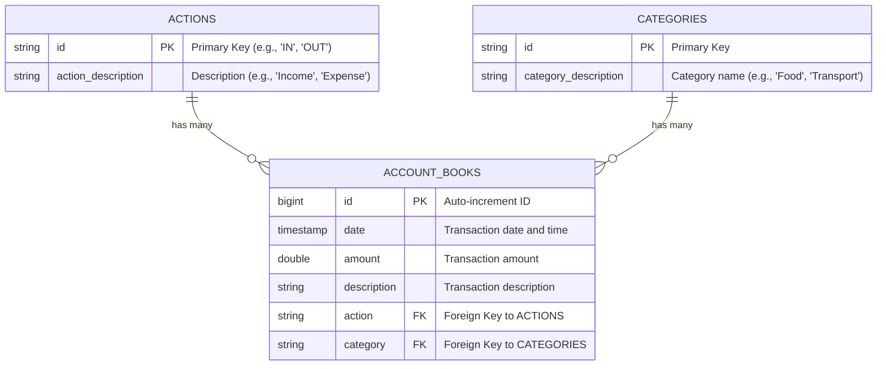

## Overview

EasyACT uses **PostgreSQL 15** as its relational database with **Spring Data JPA** for ORM (Object-Relational Mapping). The schema consists of three core tables that model financial transactions, categories, and action types.

<Note>
  Entity models are located at `api/src/main/java/com/raylon/api/model/` and use JPA annotations for database mapping.
</Note>

## Entity Relationship Diagram



<Tip>
  The schema follows a **Many-to-One** relationship pattern where multiple account book entries can reference the same action or category.
</Tip>

## Database Tables

### 1. `account_books` (Main Transaction Table)

The primary table storing all financial transaction records.

<ParamField path="id" type="BIGSERIAL" required>
  **Primary Key**. Auto-incrementing unique identifier for each transaction.
  
  Generated using `IDENTITY` strategy.
</ParamField>

<ParamField path="date" type="TIMESTAMP">
  Date and time when the transaction occurred.
  
  Maps to Java `LocalDateTime` type.
</ParamField>

<ParamField path="amount" type="DOUBLE PRECISION">
  Transaction amount (positive for income, typically positive for expense).
  
  Stored as `Double` in Java.
</ParamField>

<ParamField path="description" type="VARCHAR">
  User-provided description or note about the transaction.
  
  Optional text field for context.
</ParamField>

<ParamField path="action" type="VARCHAR" required>
  **Foreign Key** to `actions` table.
  
  References whether this is an income or expense transaction.
</ParamField>

<ParamField path="category" type="VARCHAR" required>
  **Foreign Key** to `categories` table.
  
  Classifies the transaction type (e.g., Food, Transport, Salary).
</ParamField>

<Accordion title="AccountBook Entity Model">
```java AccountBook.java
package com.raylon.api.model;

import java.time.LocalDateTime;
import jakarta.persistence.*;
import lombok.Getter;
import lombok.Setter;

@Entity
@Table(name = "account_books")
@Getter
@Setter
public class AccountBook {
    @Id
    @GeneratedValue(strategy = GenerationType.IDENTITY)
    @Column(name = "id")
    private Long id;

    @Column(name = "date")
    private LocalDateTime date;

    @Column(name = "amount")
    private Double amount;

    @Column(name = "description")
    private String description;

    // Many AccountBooks -> One Action
    @ManyToOne(fetch = FetchType.EAGER)
    @JoinColumn(name = "action")
    private Action action;

    // Many AccountBooks -> One Category
    @ManyToOne(fetch = FetchType.EAGER)
    @JoinColumn(name = "category")
    private Category category;
}
```

**Key Features**:
- Uses `@GeneratedValue` with `IDENTITY` strategy for auto-increment
- `@ManyToOne` relationships with `EAGER` fetching for actions and categories
- Lombok `@Getter` and `@Setter` for automatic accessor methods
</Accordion>

---

### 2. `actions` (Transaction Type Table)

Lookup table defining transaction action types (Income vs. Expense).

<ParamField path="id" type="VARCHAR" required>
  **Primary Key**. Short code identifier (e.g., `"IN"`, `"OUT"`).
  
  Manually assigned, not auto-generated.
</ParamField>

<ParamField path="action_description" type="VARCHAR">
  Human-readable description of the action type.
  
  Examples: "Income", "Expense" (or localized equivalents "收入", "支出").
</ParamField>

<Accordion title="Action Entity Model">
```java Action.java
package com.raylon.api.model;

import java.util.List;
import jakarta.persistence.*;
import lombok.Getter;
import lombok.Setter;

@Entity
@Table(name = "actions")
@Getter
@Setter
public class Action {
    @Id
    @Column(name = "id")
    private String id; // e.g., "IN", "OUT"

    @Column(name = "action_description")
    private String actionDescription; // e.g., "Income", "Expense"

    // Reverse relationship (bidirectional)
    @OneToMany(mappedBy = "action", fetch = FetchType.LAZY)
    private List<AccountBook> accountBooks;
}
```

**Key Features**:
- String-based primary key for semantic IDs
- Bidirectional `@OneToMany` relationship (optional, for reverse navigation)
- `LAZY` fetch on reverse relationship to avoid N+1 queries
</Accordion>

<CodeGroup>
```sql Example Data
INSERT INTO actions (id, action_description) VALUES
  ('IN', 'Income'),
  ('OUT', 'Expense');
```
</CodeGroup>

---

### 3. `categories` (Transaction Category Table)

Lookup table for transaction categories (Food, Transport, Salary, etc.).

<ParamField path="id" type="VARCHAR" required>
  **Primary Key**. Category identifier code.
  
  Could be short codes like `"FOOD"`, `"TRANS"`, or UUIDs.
</ParamField>

<ParamField path="category_description" type="VARCHAR">
  Display name for the category.
  
  Examples: "Food", "Transportation", "Salary", "Entertainment".
</ParamField>

<Accordion title="Category Entity Model">
```java Category.java
package com.raylon.api.model;

import java.util.List;
import jakarta.persistence.*;
import lombok.Getter;
import lombok.Setter;

@Entity
@Table(name = "categories")
@Getter
@Setter
public class Category {
    @Id
    @Column(name = "id")
    private String id;

    @Column(name = "category_description")
    private String categoryDescription;

    // Reverse relationship (bidirectional)
    @OneToMany(mappedBy = "category", fetch = FetchType.LAZY)
    private List<AccountBook> accountBooks;
}
```

**Key Features**:
- String-based primary key for flexibility
- Bidirectional `@OneToMany` relationship
- `LAZY` fetch strategy on collection
</Accordion>

<CodeGroup>
```sql Example Categories
INSERT INTO categories (id, category_description) VALUES
  ('FOOD', 'Food & Dining'),
  ('TRANS', 'Transportation'),
  ('SALARY', 'Salary'),
  ('UTIL', 'Utilities'),
  ('ENT', 'Entertainment');
```
</CodeGroup>

---

## Relationships

### Many-to-One Relationships

The `account_books` table has **two Many-to-One relationships**:

<CardGroup cols={2}>
  <Card title="AccountBook → Action" icon="arrow-right">
    **Cardinality**: Many-to-One
    
    Multiple transactions can share the same action type.
    
    ```java
    @ManyToOne(fetch = FetchType.EAGER)
    @JoinColumn(name = "action")
    private Action action;
    ```
  </Card>
  
  <Card title="AccountBook → Category" icon="arrow-right">
    **Cardinality**: Many-to-One
    
    Multiple transactions can belong to the same category.
    
    ```java
    @ManyToOne(fetch = FetchType.EAGER)
    @JoinColumn(name = "category")
    private Category category;
    ```
  </Card>
</CardGroup>

<Warning>
  Both relationships use `EAGER` fetching, meaning related `Action` and `Category` entities are loaded immediately with each `AccountBook` query. Consider changing to `LAZY` if performance issues arise with large datasets.
</Warning>

### One-to-Many Relationships (Reverse)

Both `Action` and `Category` entities define reverse `@OneToMany` relationships:

```java
// In Action.java and Category.java
@OneToMany(mappedBy = "action", fetch = FetchType.LAZY)
private List<AccountBook> accountBooks;
```

<Accordion title="When to Use Reverse Relationships">
  **Use cases**:
  - Fetching all transactions for a specific category
  - Calculating total expenses per action type
  - Cascading operations (if configured)
  
  **Performance note**: Uses `LAZY` loading to avoid loading all transactions when fetching actions/categories.
</Accordion>

---

## JPA Configuration

### Fetch Strategies

<Tabs>
  <Tab title="EAGER Fetching">
    Used in `AccountBook` for `action` and `category` relationships:
    
    ```java
    @ManyToOne(fetch = FetchType.EAGER)
    ```
    
    **Pros**:
    - Related entities loaded in single query
    - No lazy initialization exceptions
    - Simpler to work with in DTOs
    
    **Cons**:
    - Can cause N+1 query problems
    - Loads data that might not be needed
  </Tab>
  
  <Tab title="LAZY Fetching">
    Used in `Action` and `Category` for reverse relationships:
    
    ```java
    @OneToMany(mappedBy = "action", fetch = FetchType.LAZY)
    ```
    
    **Pros**:
    - Better performance for large collections
    - Only loads when accessed
    - Reduces memory usage
    
    **Cons**:
    - Requires active session to access
    - Can cause lazy initialization exceptions
  </Tab>
</Tabs>

### Primary Key Strategies

<AccordionGroup>
  <Accordion title="Auto-Increment (IDENTITY)">
    **Used in**: `AccountBook.id`
    
    ```java
    @Id
    @GeneratedValue(strategy = GenerationType.IDENTITY)
    private Long id;
    ```
    
    PostgreSQL uses `BIGSERIAL` type for auto-incrementing IDs.
  </Accordion>
  
  <Accordion title="Manual String IDs">
    **Used in**: `Action.id`, `Category.id`
    
    ```java
    @Id
    @Column(name = "id")
    private String id;
    ```
    
    Allows semantic identifiers like `"IN"`, `"OUT"`, `"FOOD"`, etc.
  </Accordion>
</AccordionGroup>

---

## Database Constraints

### Primary Keys

| Table | Primary Key | Type | Strategy |
|-------|-------------|------|----------|
| `account_books` | `id` | `BIGINT` | Auto-increment (IDENTITY) |
| `actions` | `id` | `VARCHAR` | Manual assignment |
| `categories` | `id` | `VARCHAR` | Manual assignment |

### Foreign Keys

<Steps>
  <Step title="account_books.action → actions.id">
    Ensures every transaction references a valid action type.
    
    ```sql
    FOREIGN KEY (action) REFERENCES actions(id)
    ```
  </Step>
  
  <Step title="account_books.category → categories.id">
    Ensures every transaction references a valid category.
    
    ```sql
    FOREIGN KEY (category) REFERENCES categories(id)
    ```
  </Step>
</Steps>

<Note>
  Foreign key constraints are enforced by PostgreSQL and managed by JPA through `@JoinColumn` annotations.
</Note>

---

## Common Queries

### Fetch Transaction with Related Data

```java
// Using JPA Repository
Optional<AccountBook> transaction = accountBookRepository.findById(1L);

// action and category are automatically loaded (EAGER fetch)
String actionType = transaction.get().getAction().getActionDescription();
String categoryName = transaction.get().getCategory().getCategoryDescription();
```

### Find All Transactions by Category

```java
// Repository method
List<AccountBook> findByCategory(Category category);

// Usage
Category foodCategory = categoryRepository.findById("FOOD").orElseThrow();
List<AccountBook> foodTransactions = accountBookRepository.findByCategory(foodCategory);
```

### Calculate Total by Action Type

```java
// Custom repository query
@Query("SELECT SUM(a.amount) FROM AccountBook a WHERE a.action.id = :actionId")
Double sumByActionType(@Param("actionId") String actionId);

// Usage
Double totalIncome = accountBookRepository.sumByActionType("IN");
Double totalExpense = accountBookRepository.sumByActionType("OUT");
```

---

## Schema Management

### JPA Auto-DDL

<Accordion title="application.properties Configuration">
```properties
# Auto-create schema from entities (development only)
spring.jpa.hibernate.ddl-auto=update

# Show SQL queries in logs
spring.jpa.show-sql=true

# Format SQL for readability
spring.jpa.properties.hibernate.format_sql=true

# PostgreSQL dialect
spring.jpa.properties.hibernate.dialect=org.hibernate.dialect.PostgreSQLDialect
```

<Warning>
  Use `ddl-auto=validate` or `ddl-auto=none` in production. Let migration tools like Flyway or Liquibase handle schema changes.
</Warning>
</Accordion>

### Data Persistence

Database data is persisted using Docker volumes:

```yaml
volumes:
  postgres-data:
    driver: local

services:
  db:
    image: postgres:15
    volumes:
      - postgres-data:/var/lib/postgresql/data
```

<Tip>
  Data survives container restarts. To reset database, delete the volume: `docker-compose down -v`
</Tip>

---

## Best Practices

<CardGroup cols={2}>
  <Card title="Use DTOs" icon="exchange">
    Avoid exposing entities directly in REST APIs. Use Data Transfer Objects to prevent lazy loading issues and circular references.
  </Card>
  
  <Card title="Index Foreign Keys" icon="magnifying-glass">
    PostgreSQL automatically indexes foreign keys, but verify performance on large tables.
  </Card>
  
  <Card title="Validate Input" icon="shield-check">
    Always validate that referenced actions and categories exist before creating transactions.
  </Card>
  
  <Card title="Use Transactions" icon="database">
    Wrap multi-step operations in `@Transactional` to ensure data consistency.
  </Card>
</CardGroup>

---

## Next Steps

<CardGroup cols={2}>
  <Card title="System Architecture" icon="sitemap" href="/development/architecture">
    See how the database fits into the overall system
  </Card>
  
  <Card title="Technology Stack" icon="layer-group" href="/development/tech-stack">
    Review all technologies and versions used
  </Card>
</CardGroup>